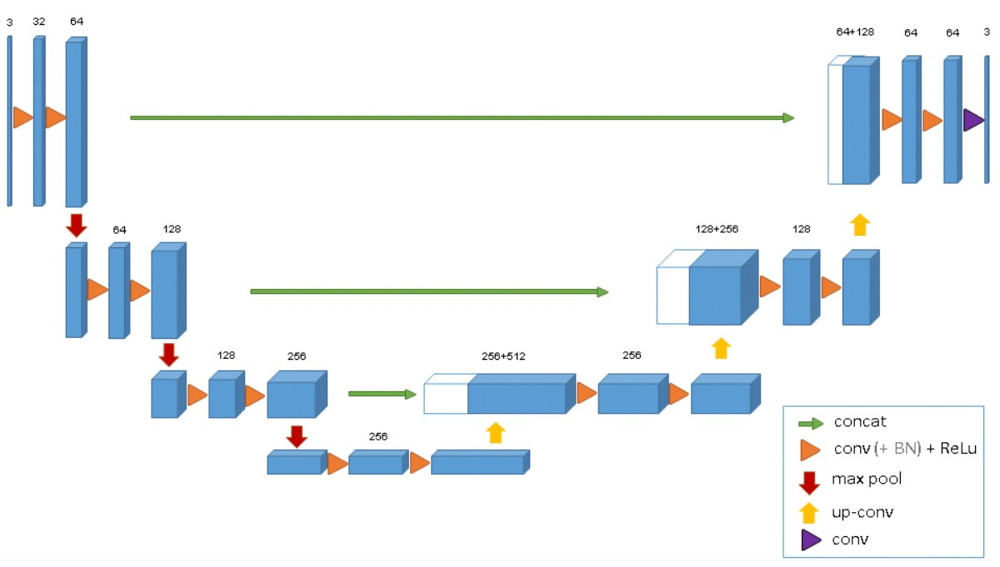
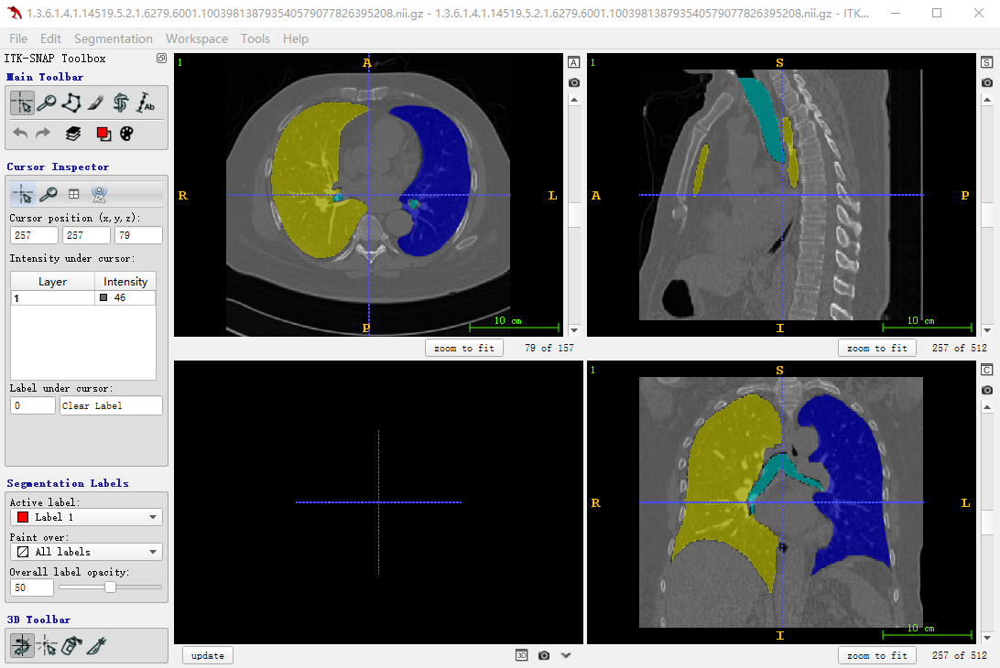

# SCU-MindSpore-UNnet3D-project

### 1、介绍

华为-MindSpore UNet3D实现案例

### 2、方法

本仓库在华为-Mindspore深度学习框架下实现Unet3D案例  
文章：[3D U-Net: Learning Dense Volumetric Segmentation from Sparse Annotation](https://lmb.informatik.uni-freiburg.de/Publications/2016/CABR16/cicek16miccai.pdf)

网络结构如图所示，输入图片的大小为W×H×D，上图中的通道数为3，即输入图像有三个不同的模态，相对于平常的2D图片，除了width、heigh，3D图片多了depth这个维度，然后通过卷积层升高图片的通道数，再通过max pooling层降低特征的分辨率大小，然后经过encoder之后，再利用反卷积层增大特征的分辨率，直到得到输入图片大小的特征，为了保留细节信息，将浅层特征和深层特征经过skip connection拼接起来，使得提取的特征更丰富，decoder的输出为预测的分割图像，再将其和标签做损失函数，这里我们采用交叉熵损失和dice损失。

### 3、案例实现
# 3.1 环境配置
   本案例中的
# 3.2 数据集准备
   (1) 下载[LUNA16](https://luna16.grand-challenge.org/)数据集到本地，放在data文件夹中  
   (2) 进入路径./data/LUNA16, 将得到的subset0-9.rar和seg-lungs-LUNA16.rar共11个文件解压  
   (3) 设置路径，运行下面代码，划分训练集和验证集，并且将数据格式转化为niffi，得到如下的文件结构：  
```
      ./data/
      └── LUNA16
          ├── train
                └── images
                └── seg
          ├── val
                └── images
                └── seg
``` 


     注：
        （1）LUNA16数据集共887个volume，我们选择subset9的最后三个volume作为验证集，subset0-8进而subset9剩下的部分作为训练集。
        （2）可以通过下载ITK-SNAP软件可视化图片和分割标签
      
# 3.3 
