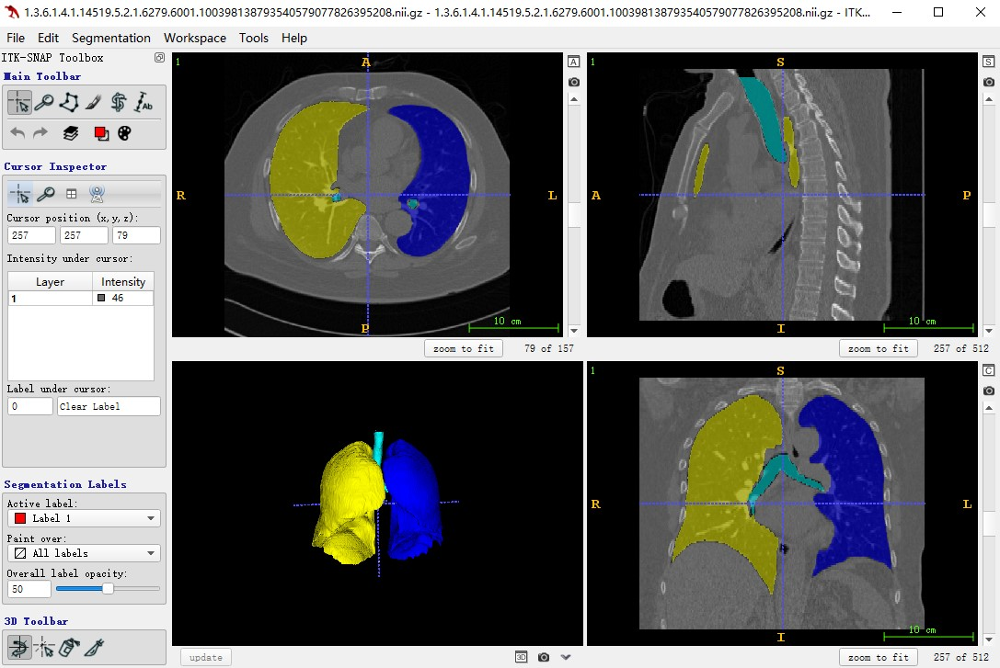

# SCU-MindSpore-UNnet3D-project

## 1、介绍

华为-MindSpore UNet3D实现案例

## 2、方法

本仓库在华为-Mindspore深度学习框架下实现Unet3D案例  
文章：[3D U-Net: Learning Dense Volumetric Segmentation from Sparse Annotation](https://lmb.informatik.uni-freiburg.de/Publications/2016/CABR16/cicek16miccai.pdf)

网络结构如图所示，输入图片的大小为W×H×D，上图中的通道数为3，即输入图像有三个不同的模态，相对于平常的2D图片，除了width、heigh，3D图片多了depth这个维度，然后通过卷积层升高图片的通道数，再通过max pooling层降低特征的分辨率大小，然后经过encoder之后，再利用反卷积层增大特征的分辨率，直到得到输入图片大小的特征，为了保留细节信息，将浅层特征和深层特征经过skip connection拼接起来，使得提取的特征更丰富，decoder的输出为预测的分割图像，再将其和标签做损失函数，这里我们采用交叉熵损失和dice损失。

## 3、案例实现
### 3.1 环境配置
   本案例中的
### 3.2 数据集准备
   (1) 下载[LUNA16](https://luna16.grand-challenge.org/)肺结节分割数据集到本地，放在data文件夹中;  
   (2) 进入路径./data/LUNA16, 将得到的subset0-9.rar和seg-lungs-LUNA16.rar共11个文件解压;  
   (3) 设置路径，运行下面代码，划分训练集和验证集，并且将数据格式转化为niffi，得到如下的文件结构：  
```
      ./data/
      └── LUNA16
          ├── train
                └── images
                └── seg
          ├── val
                └── images
                └── seg
``` 


注：  
    （1）LUNA16数据集共887个volume，我们选择subset9的最后10个volume作为验证集，subset0-8进而subset9剩下的部分作为训练集。  
    （2）可以通过下载ITK-SNAP软件可视化图片和分割标签
       
     
### 3.3 参数设置（训练参数和dataloader参数）
在训练过程中的参数设置，如图片大小、训练batchsize大小等
``` python
import ml_collections
import warnings
warnings.filterwarnings("ignore")

def get_config():
    """
    Get Config according to the yaml file and cli arguments.
    """
    cfg = ml_collections.ConfigDict()
    cfg.enable_fp16_gpu=False
    cfg.enable_modelarts=False
    # Url for modelarts
    cfg.data_url=""
    cfg.train_ur=""
    cfg.checkpoint_url=""
    # Path for local
    cfg.run_distribute=False
    cfg.enable_profiling=False
    cfg.data_path="data/LUNA16/train/"
    cfg.output_path="output"
    cfg.load_path="/checkpoint_path/"
    cfg.device_target="GPU"
    cfg.checkpoint_path="./checkpoint/"
    cfg.checkpoint_file_path="Unet3d-10-110.ckpt"

    # ==============================================================================
    # data loader options
    cfg.num_worker = 4
    # Training options
    cfg.lr=0.0005
    cfg.batch_size=2
    cfg.epoch_size=10
    cfg.warmup_step=120
    cfg.warmup_ratio=0.3
    cfg.num_classes=4
    cfg.in_channels=1
    cfg.keep_checkpoint_max=1
    cfg.loss_scale=256.0
    cfg.roi_size=[224, 224, 96]
    cfg.overlap=0.25
    cfg.min_val=-500
    cfg.max_val=1000
    cfg.upper_limit=5
    cfg.lower_limit=3

    # Export options
    cfg.device_id=0
    cfg.ckpt_file="./checkpoint/Unet3d-10-110.ckpt"
    cfg.file_name="unet3d"
    cfg.file_format="MINDIR"

    # 310 infer options
    cfg.pre_result_path="./preprocess_Result"
    cfg.post_result_path="./result_Files"

    return cfg

config = get_config()
``` 
### 3.4 创建不同的数据集增强方式
完成上述的文件格式转换之后，并进一步划分了训练和测试数据集，但是直接将图片数据送入网络训练，结果往往不太理想，因此需要通过不同的transform操作进行数据集增强，数据增强的方式包括：ExpandChannel、ScaleIntensityRange、RandomCropSamples、OneHot等
### 3.4 创建Dataloader

### 3.5 构建Unet3D网络结构

### 3.6 自定义Metrics

### 3.7 定义损失函数

### 3.8 主函数训练

### 3.9 模型预测

### 3.10 训练结果可视化
