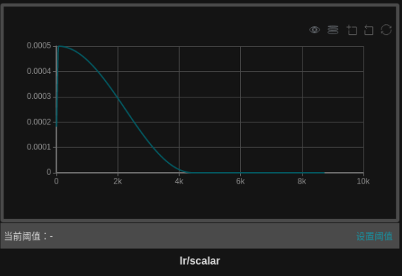
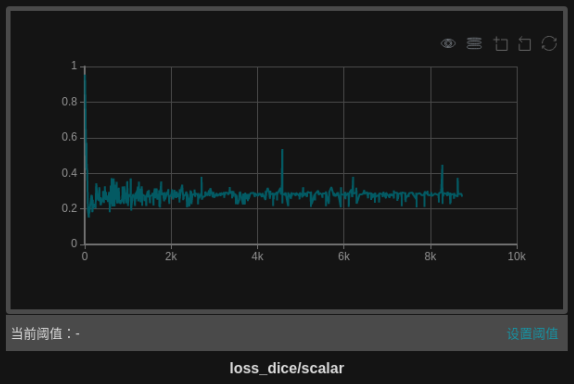
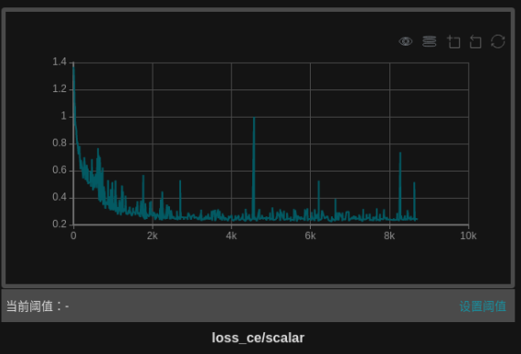
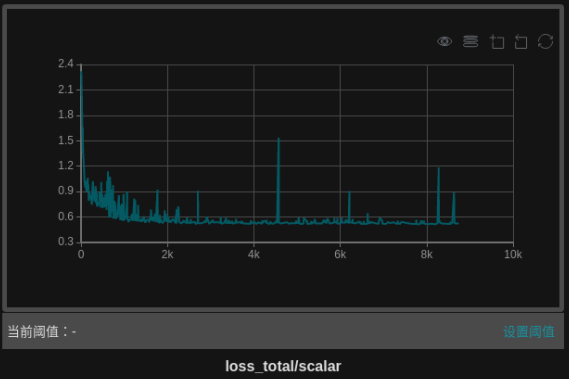

# SCU-MindSpore-UNnet3D-project

## 1、介绍

华为-MindSpore UNet3D实现案例

## 2、方法

本仓库在华为-Mindspore深度学习框架下实现Unet3D案例  
文章：[3D U-Net: Learning Dense Volumetric Segmentation from Sparse Annotation](https://lmb.informatik.uni-freiburg.de/Publications/2016/CABR16/cicek16miccai.pdf)

网络结构如图所示，输入图片的大小为W×H×D，上图中的通道数为3，即输入图像有三个不同的模态，相对于平常的2D图片，除了width、heigh，3D图片多了depth这个维度，然后通过卷积层升高图片的通道数，再通过max pooling层降低特征的分辨率大小，然后经过encoder之后，再利用反卷积层增大特征的分辨率，直到得到输入图片大小的特征，为了保留细节信息，将浅层特征和深层特征经过skip connection拼接起来，使得提取的特征更丰富，decoder的输出为预测的分割图像，再将其和标签做损失函数，这里我们采用交叉熵损失和dice损失。

## 3、案例实现
### 3.1 环境配置
   本案例中的
### 3.2 数据集准备
   (1) 下载[LUNA16](https://luna16.grand-challenge.org/)肺结节分割数据集到本地，放在data文件夹中;  
   (2) 进入路径./data/LUNA16, 将得到的subset0-9.rar和seg-lungs-LUNA16.rar共11个文件解压;  
   (3) 设置路径，运行下面代码，划分训练集和验证集，并且将数据格式转化为niffi，得到如下的文件结构：  
```
      ./data/
      └── LUNA16
          ├── train
                └── images
                └── seg
          ├── val
                └── images
                └── seg
``` 

注：  
    （1）LUNA16数据集共887个volume，我们选择subset9的最后10个volume作为验证集，subset0-8进而subset9剩下的部分作为训练集。  
    （2）可以通过下载ITK-SNAP软件可视化图片和分割标签
       
     
### 3.3 参数设置（训练参数和dataloader参数）
在训练过程中的参数设置，如图片大小、训练batchsize大小等
``` python
import ml_collections
import warnings
warnings.filterwarnings("ignore")

def get_config():
    """
    Get Config according to the yaml file and cli arguments.
    """
    cfg = ml_collections.ConfigDict()
    cfg.enable_fp16_gpu=False
    cfg.enable_modelarts=False
    # Url for modelarts
    cfg.data_url=""
    cfg.train_ur=""
    cfg.checkpoint_url=""
    # Path for local
    cfg.run_distribute=False
    cfg.enable_profiling=False
    cfg.data_path="data/LUNA16/train/"
    cfg.output_path="output"
    cfg.load_path="/checkpoint_path/"
    cfg.device_target="GPU"
    cfg.checkpoint_path="./checkpoint/"
    cfg.checkpoint_file_path="Unet3d-10-110.ckpt"

    # ==============================================================================
    # data loader options
    cfg.num_worker = 4
    # Training options
    cfg.lr=0.0005
    cfg.batch_size=2
    cfg.epoch_size=10
    cfg.warmup_step=120
    cfg.warmup_ratio=0.3
    cfg.num_classes=4
    cfg.in_channels=1
    cfg.keep_checkpoint_max=1
    cfg.loss_scale=256.0
    cfg.roi_size=[224, 224, 96]
    cfg.overlap=0.25
    cfg.min_val=-500
    cfg.max_val=1000
    cfg.upper_limit=5
    cfg.lower_limit=3

    # Export options
    cfg.device_id=0
    cfg.ckpt_file="./checkpoint/Unet3d-10-110.ckpt"
    cfg.file_name="unet3d"
    cfg.file_format="MINDIR"

    # 310 infer options
    cfg.pre_result_path="./preprocess_Result"
    cfg.post_result_path="./result_Files"

    return cfg

config = get_config()
``` 
### 3.4 创建不同的数据集增强方式
完成上述的文件格式转换之后，并进一步划分了训练和测试数据集，但是直接将图片数据送入网络训练，结果往往不太理想，因此需要通过不同的transform操作进行数据集增强，数据增强的方式包括：ExpandChannel、ScaleIntensityRange、RandomCropSamples、OneHot等，以RandomCropSamples为例
``` python
class RandomCropSamples:
    def __init__(self, roi_size, num_samples=1):
        self.roi_size = roi_size
        self.num_samples = num_samples
        self.set_random_state(0)

    def set_random_state(self, seed=None):
        """
        Set the random seed to control the slice size.

        Args:
            seed: set the random state with an integer seed.
        """
        MAX_SEED = np.iinfo(np.uint32).max + 1
        if seed is not None:
            _seed = seed % MAX_SEED
            self.rand_fn = np.random.RandomState(_seed)
        else:
            self.rand_fn = np.random.RandomState()
        return self

    def get_random_patch(self, dims, patch_size, rand_fn=None):
        """
        Returns a tuple of slices to define a random patch in an array of shape `dims` with size `patch_size`.
        """
        rand_int = np.random.randint if rand_fn is None else rand_fn.randint
        min_corner = tuple(rand_int(0, ms - ps + 1) if ms > ps else 0 for ms, ps in zip(dims, patch_size))
        return tuple(slice(mc, mc + ps) for mc, ps in zip(min_corner, patch_size))

    def get_random_slice(self, img_size):
        slices = (slice(None),) + self.get_random_patch(img_size, self.roi_size, self.rand_fn)
        return slices

    def __call__(self, image, label):
        res_image = []
        res_label = []
        for _ in range(self.num_samples):
            slices = self.get_random_slice(image.shape[1:])
            img = image[slices]
            label_crop = label[slices]
            res_image.append(img)
            res_label.append(label_crop)
        return np.array(res_image), np.array(res_label)
``` 
### 3.4 创建Dataloader
设置好数据预处理之后，接下来需要定义一个可迭代的Dataloader用于数据加载，然后送入网络
```python
import glob
import mindspore.dataset as ds
from mindspore.dataset.transforms.transforms import Compose
import nibabel as nib
import os

class Dataset:
    def __init__(self, data, seg):
        self.data = data
        self.seg = seg
    def __len__(self):
        return len(self.data)
    def __getitem__(self, index):
        data = self.data[index]
        seg = self.seg[index]
        return [data], [seg]

def create_dataset(data_path, seg_path, rank_size=1, rank_id=0, is_training=True):
    seg_files = sorted(glob.glob(os.path.join(seg_path, "*.nii.gz")))
    train_files = [os.path.join(data_path, os.path.basename(seg)) for seg in seg_files]
    train_ds = Dataset(data=train_files, seg=seg_files)
    train_loader = ds.GeneratorDataset(train_ds, column_names=["image", "seg"], num_parallel_workers=config.num_worker, \
                                       shuffle=is_training, num_shards=rank_size, shard_id=rank_id)

    if is_training:
        transform_image = Compose([LoadData(),
                                   ExpandChannel(),
                                   Orientation(),
                                   ScaleIntensityRange(src_min=config.min_val, src_max=config.max_val, tgt_min=0.0, \
                                                       tgt_max=1.0, is_clip=True),
                                   RandomCropSamples(roi_size=config.roi_size, num_samples=4),
                                   ConvertLabel(),
                                   OneHot(num_classes=config.num_classes)])
    else:
        transform_image = Compose([LoadData(),
                                   ExpandChannel(),
                                   Orientation(),
                                   ScaleIntensityRange(src_min=config.min_val, src_max=config.max_val, tgt_min=0.0, \
                                                       tgt_max=1.0, is_clip=True),
                                   ConvertLabel()])

    train_loader = train_loader.map(operations=transform_image,
                                    input_columns=["image", "seg"],
                                    num_parallel_workers=config.num_worker,
                                    python_multiprocessing=True)
    if not is_training:
        train_loader = train_loader.batch(1)
    return train_loader
``` 

### 3.5 构建Unet3D网络结构
构建Unet3D网络，包括Encoder和Decoder两部分，Encoder有4个下采样层；Decoder有4个上采样层，最后的输出和原图大小相同的分割结果。
```python
import mindspore as ms
import mindspore.nn as nn
from mindspore import dtype as mstype
from mindspore.ops import operations as P
from src.unet3d_parts import Down, Up
import numpy as np

class UNet3d_(nn.Cell):
    """
    UNet3d_ support fp32 and fp16(amp) training on GPU.
    """
    def __init__(self):
        super(UNet3d_, self).__init__()
        self.n_channels = config.in_channels
        self.n_classes = config.num_classes

        # down
        self.down1 = Down(in_channel=self.n_channels, out_channel=16, dtype=mstype.float32)
        self.down2 = Down(in_channel=16, out_channel=32, dtype=mstype.float32)
        self.down3 = Down(in_channel=32, out_channel=64, dtype=mstype.float32)
        self.down4 = Down(in_channel=64, out_channel=128, dtype=mstype.float32)
        self.down5 = Down(in_channel=128, out_channel=256, stride=1, kernel_size=(1, 1, 1), \
                          dtype=mstype.float32)
        # up
        self.up1 = Up(in_channel=256, down_in_channel=128, out_channel=64, \
                      dtype=mstype.float32)
        self.up2 = Up(in_channel=64, down_in_channel=64, out_channel=32, \
                      dtype=mstype.float32)
        self.up3 = Up(in_channel=32, down_in_channel=32, out_channel=16, \
                      dtype=mstype.float32)
        self.up4 = Up(in_channel=16, down_in_channel=16, out_channel=self.n_classes, \
                      dtype=mstype.float32, is_output=True)

    def construct(self, input_data):
        x1 = self.down1(input_data)
        x2 = self.down2(x1)
        x3 = self.down3(x2)
        x4 = self.down4(x3)
        x5 = self.down5(x4)

        x = self.up1(x5, x4)
        x = self.up2(x, x3)
        x = self.up3(x, x2)
        x = self.up4(x, x1)
        return x
``` 
### 3.6 自定义Metrics
在医学图像分割领域，通过Dice coefficient、Jaccard coefficient、Hausdorff distance 95、Average surface distance、Average symmetric surface distance metric、sensitivity等量化指标来衡量分割效果的好坏。
```python
from medpy.metric import binary

class metrics:
    def __init__(self, smooth=1e-5):
        self.smooth=1e-5

    def dice_metric(self, y_pred, y_label, empty_score=1.0):
        """Calculates the dice coefficient for the images"""
        return binary.dc(y_pred, y_label)

    def jc_metric(self, y_pred, y_label):
        """Jaccard coefficient"""
        return binary.jc(y_pred, y_label)

    def hd95_metric(self, y_pred, y_label):
        """Calculates the hausdorff distance for the images"""
        return binary.hd95(y_pred, y_label, voxelspacing=None)

    def asd_metric(self, y_pred, y_label):
        """Average surface distance metric."""
        return binary.asd(y_pred, y_label, voxelspacing=None)

    def assd_metric(self, y_pred, y_label):
        """Average symmetric surface distance metric."""
        return binary.assd(y_pred, y_label, voxelspacing=None)

    def precision_metric(self, y_pred, y_label):
        """precision metric."""
        return binary.precision(y_pred, y_label, voxelspacing=None)

    def sensitivity_metric(self, y_pred, y_label, smooth = 1e-5):
        """recall(also sensitivity) metric."""
        return binary.recall(y_pred, y_label)
``` 

### 3.7 设置学习率策略
学习率的设置对网络的训练至关重要，在这里我们使用两阶段的学习率，前三个epoch进行warm up，使用线性上升学习率策略，后面七个epoch使用consine下降学习率策略，使用mindinsight进行可视化，如下图所示：

```python
# dyanmic learning rate
import math

def linear_warmup_learning_rate(current_step, warmup_steps, base_lr, init_lr):
    lr_inc = (float(base_lr) - float(init_lr)) / float(warmup_steps)
    learning_rate = float(init_lr) + lr_inc * current_step
    return learning_rate

def a_cosine_learning_rate(current_step, base_lr, warmup_steps, decay_steps):
    base = float(current_step - warmup_steps) / float(decay_steps)
    learning_rate = (1 + math.cos(base * math.pi)) / 2 * base_lr
    return learning_rate

def dynamic_lr(config, base_step):
    """dynamic learning rate generator"""
    base_lr = config.lr
    total_steps = int(base_step * config.epoch_size)
    warmup_steps = config.warmup_step
    lr = []
    for i in range(total_steps):
        if i < warmup_steps:
            lr.append(linear_warmup_learning_rate(i, warmup_steps, base_lr, base_lr * config.warmup_ratio))
        else:
            lr.append(a_cosine_learning_rate(i, base_lr, warmup_steps, total_steps))
    return lr
``` 
### 3.7 定义损失函数

### 3.8 主函数训练
```python
import os
import mindspore
import mindspore.nn as nn
from mindspore import ops
import mindspore.common.dtype as mstype
from mindspore import Tensor, Model, context
from mindspore.context import ParallelMode
from mindspore.communication.management import init, get_rank, get_group_size
from mindspore.train.loss_scale_manager import FixedLossScaleManager

if config.device_target == 'Ascend':
    device_id = int(os.getenv('DEVICE_ID'))
    context.set_context(mode=context.GRAPH_MODE, device_target=config.device_target, save_graphs=False, \
                        device_id=device_id)
else:
    context.set_context(mode=context.GRAPH_MODE, device_target=config.device_target, save_graphs=False)

mindspore.set_seed(1)

@moxing_wrapper()
def train_net(run_distribute=False):
    if run_distribute:
        init()
        if config.device_target == 'Ascend':
            rank_id = get_device_id()
            rank_size = get_device_num()
        else:
            rank_id = get_rank()
            rank_size = get_group_size()
        parallel_mode = ParallelMode.DATA_PARALLEL
        context.set_auto_parallel_context(parallel_mode=parallel_mode,
                                          device_num=rank_size,
                                          gradients_mean=True)
    else:
        rank_id = 0
        rank_size = 1

    train_dataset = create_dataset(data_path=config.data_path + "/image/",
                                   seg_path=config.data_path + "/seg/",
                                   rank_size=rank_size,
                                   rank_id=rank_id, is_training=True)
    train_data_size = train_dataset.get_dataset_size()
    print("train dataset length is:", train_data_size)

    if config.device_target == 'Ascend':
        network = UNet3d()
    else:
        network = UNet3d_()

    # (3)define loss funtion
    loss_ce_fn = nn.CrossEntropyLoss()
    loss_dice_fn = nn.DiceLoss(smooth=1e-5)
    # (4) lr shedule and optimizor
    lr = Tensor(dynamic_lr(config, train_data_size), mstype.float32)
    optimizer = nn.Adam(params=network.trainable_params(), learning_rate=lr)
    # (5) set training mode
    network.set_train()
    # (9) Start training
    print("============== Starting Training ==============")
    def forward_fn(data, label):
        logits = network(data)
        loss_ce = loss_ce_fn(logits, label)
        loss_dice = loss_dice_fn(logits, label)
        loss = loss_dice + loss_ce
        return loss, logits
    # Get gradient function
    grad_fn = ops.value_and_grad(forward_fn, None, optimizer.parameters, has_aux=True)
    # Define function of one-step training
    def train_step(data, label):
        (loss, _), grads = grad_fn(data, label)
        loss = ops.depend(loss, optimizer(grads))
        return loss
    for epoch in range(10):
        for batch, (data, label) in enumerate(train_dataset.create_tuple_iterator()):
            loss = train_step(data, label)
            current_lr = optimizer.get_lr()
            print("Epoch: %d [%d/%d] lr:%.7f Loss: %.4f" % (epoch, batch, train_data_size, current_lr, loss.asnumpy()))

        # Save checkpoint
        ckpt_save_dir = os.path.join(config.output_path, config.checkpoint_path)
        mindspore.save_checkpoint(network, os.path.join(ckpt_save_dir, "Epoch_"+str(epoch)+"_model.ckpt"))
        print("Saved Model to {}/model_{}_epoch.ckpt".format(ckpt_save_dir, epoch))
    print("============== End Training ==============")

if __name__ == '__main__':
    train_net()
```
### 3.9 模型预测

### 3.10 训练结果可视化



